<!-- Profile repository: TDMNQS/TDMNQS · Display name: Numan Qureshi -->

  

  

  
  

  <b>Research-minded. Backend-focused. Always building.</b> 
  I build AI applications that connect information, retrieve evidence, 
  and turn complex inputs into useful next steps.

---

### 01 / THE DEVELOPER

I'm **Numan**, a final-year **Information Technology student at MGM University**, with a minor in **IoT & Big Data** and hands-on **Linux operations experience**.

My work sits at the intersection of **AI, backend engineering, and full-stack development**. I'm especially interested in what happens between a document entering a system and a useful, source-grounded answer coming out.

| Building | Exploring | Bringing |
| :--- | :--- | :--- |
| Research discovery with **SynapsGraph AI** | Citation extraction & retrieval evaluation | Team leadership & backend development |
| **FastAPI + React** applications | RAG & knowledge graphs | Frontend–backend integration |
| Evidence-grounded AI workflows | Semantic search & lexical baselines | Practical Linux operations |

### 02 / SELECTED BUILDS

<table>
<tr>
<td width="50%" valign="top">

#### 🧠 SynapsGraph AI
**Research discovery. Connected knowledge.**

My final-year team project brings semantic search and citation relationships together to help people explore research papers and ask grounded questions.

**My role:** Team leader & backend lead, with frontend and API integration contributions.

**Stack:** FastAPI · React · Qdrant · Neo4j · PostgreSQL · Redis · Docker

<a href="https://github.com/TDMNQS/Final-Year-Project"><b>Explore the research system →</b></a>

</td>
<td width="50%" valign="top">

#### 🧭 Personalized Learning Path
**A roadmap around the learner.**

An AI-powered application that turns learning goals, existing knowledge, and assessment responses into an organized study roadmap.

**My focus:** Backend development, Gemini integration, and frontend–backend communication.

**Stack:** Python · FastAPI · React · Gemini API

<a href="https://github.com/TDMNQS/AI-Powered-Personalized-Learning-Path-Generator"><b>Explore the learning platform →</b></a>

</td>
</tr>
<tr>
<td width="50%" valign="top">

#### 📄 Resume Job Match AI
**From a resume to actionable feedback.**

Resume-to-job comparison with match scoring, missing-keyword analysis, resume suggestions, and interview preparation.

**My contribution:** Adapted <a href="https://github.com/zaidwhy/resume-job-fit-ai">Resume Job-Fit AI</a>, customized branding and Gemini model configuration, and managed local setup and Git changes.

**Stack:** Python · Streamlit · Gemini API · PDF processing

<a href="https://github.com/TDMNQS/resume-job-match-ai"><b>Explore the application →</b></a>

</td>
<td width="50%" valign="top">

#### 👁️ Recall
**Exploring AI with photographic memory.**

Hands-on exploration of an open-source camera-memory assistant: turning observations into searchable memory and spoken answers.

**My focus:** Understanding perception, persistent memory, hybrid retrieval, deduplication, and API quota management.

**Stack:** FastAPI · React · Gemini Vision · ChromaDB · ONNX

<a href="https://github.com/TDMNQS/recall-spatial-ai"><b>Explore the repository →</b></a>

</td>
</tr>
</table>

### 03 / MY TOOLKIT

  

| Layer | Tools & concepts |
| :--- | :--- |
| **AI & retrieval** | Gemini APIs · RAG · Embeddings · Semantic search · BM25 |
| **Knowledge & data** | Neo4j · Qdrant · ChromaDB · PostgreSQL · Redis |
| **Applications** | FastAPI · Flask · React · Streamlit · REST APIs · WebSockets |
| **Document pipelines** | GROBID · CEX · Citation extraction · PDF processing |
| **Evaluation** | Precision@5 · Recall@5 · MRR · nDCG@5 |
| **Infrastructure** | Linux · Docker · Git · AWS |

### 04 / RESEARCH MINDSET

> **Can the system retrieve useful evidence—and show where its answer came from?**

That's the question behind my interest in research discovery. Through SynapsGraph AI, I'm exploring **citation contexts**, **semantic versus lexical retrieval**, and **knowledge graphs** that make relationships between papers easier to understand.

<b>Inside my engineering interests ↗</b>

 

- **Extraction:** Getting usable metadata, citations, and contexts out of research papers.
- **Retrieval:** Comparing embedding-based search with BM25 baselines.
- **Relationships:** Connecting papers, authors, and venues through a knowledge graph.
- **Grounding:** Keeping generated answers traceable to retrieved source material.
- **Evaluation:** Measuring retrieval quality rather than relying on fluent-looking answers.
- **Integration:** Connecting the interface, APIs, databases, and AI workflow end to end.

### 05 / BEYOND THE EDITOR

**Linux Operator · Data Binaries**  
Hands-on server management, performance monitoring, user administration, and troubleshooting.

**Community & achievements**  
IEEE Student Branch member · Budget Co-Head, Spectacle 2025 · C Language Quest winner · IIT Bombay Cloud Computing Workshop

### 06 / BUILDING IN PUBLIC

  

  

  Live activity visualization powered by GitHub Readme Activity Graph; availability and refresh timing depend on the service.

---

  <b>LET'S BUILD SOMETHING USEFUL.</b>  
  Open to <b>AI engineering · Applied AI · Software engineering internships</b> 
  Interested in teams working on retrieval, developer tools, and practical AI applications.

  <a href="https://github.com/TDMNQS?tab=repositories"><b>Explore my repositories ↗</b></a>
  &nbsp; · &nbsp;
  <a href="https://www.loom.com/share/00281c026529400ca89a095950096f71"><b>Watch Job Match AI demo ↗</b></a>

